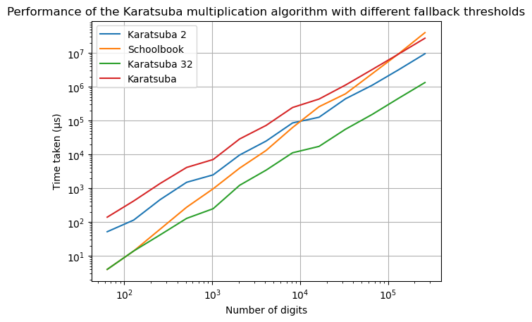

# Multiplication algorithms

multiplication algorithms experiments.

build with rust nightly because of experimental features like trait aliases

# Experimental results

Tested Schoolbook method and Karatsuba method for power-of-two same-degree polynomials. Experiments were ran on a Linux 6.17.7 system with an Intel Core i7-8086k CPU at 5.00 GHz and 16GB RAM. The different implementations of Karatsuba differ in the size of the base case, i.e. when to fallback to the schoolbook method. For instance Karatsuba 32 switches to schoolbook when handling polynomials of degree less than 32.

